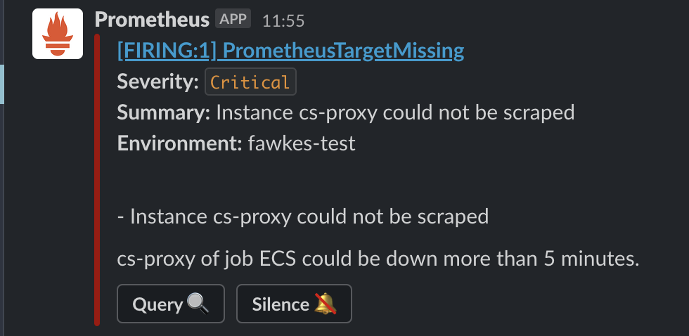

<!-- _class: lead gaia -->

# Rules And Alerts

---

# Agenda

- Prometheus Alerting Rules
- Thanos
- Alertmanager
- Alertmanager: Alert Routing
- Dead Man's Snitch (FIXME)

---

<!-- _class: lead -->

# Prometheus Alerting Rules

---

## Prometheus Alerting Rules

To include rules in Prometheus, create a file containing the necessary rule
statements and have Prometheus load the file via the `rule_files` field in the
Prometheus configuration. Rule files use YAML.

```yaml
global:
  [...]

alerting:
  [...]

rule_files:
  - rules/rules_infra.yml
  [...]

```

---

## Prometheus: Alerting Rules

/etc/prometheus/rules/rules_infra.yml

```yaml
groups:
  - name: Infra
    rules:
      # Alert for any instance that is unreachable for >5 minutes.
      - alert: PrometheusTargetMissing
        expr: up == 0
        for: 5m
        labels:
          severity: critical
        annotations:
          summary: "Instance {{ $labels.container_name }} could not be scraped"
          description: "{{ $labels.container_name }} of job {{ $labels.job }} could be down more than 5 minutes."
          environment: "{{ $externalLabels.environment }}"
```

---

<!-- _class: lead -->

# Thanos

---

## Thanos

We run a Thanos sidecar alongside each prometheus instance.
Thanos

- pushes metrics to long-term storage (S3)
- watches `prometheus.yml` for changes
- watches `/etc/prometheus/rules/` for changes

If Thanos detects changes in either the `prometheus.yml` or the alerting rules it reloads prometheus by calling `http://localhost:9090/-/reload`

---

## Long-Term Storage And Reload Configuration And Rules

Prometheus Dockerfile

```
FROM prom/prometheus:latest

[...]

COPY prometheus.yml /etc/prometheus/
COPY rules/rules_*.yml /etc/prometheus/rules/

[...]

👉 VOLUME [ "/etc/prometheus" ]

ENTRYPOINT [ "/bin/prometheus" ]

CMD        [ "--config.file=/etc/prometheus/prometheus.yml", \
           [...]
👉         "--web.enable-admin-api", \
👉         "--web.enable-lifecycle" ]
```

---

Task-Definition of the Prometheus task:

```json
[
  # the prometheus container 👇
  {
    "name": "prometheus",
    [...]
  },
  #
  # the thanos sidecar container 👇
  #
  {
    "name": "thanos",
    [...]
    "entrypoint": [
      "/bin/thanos",
      "sidecar",
      "--tsdb.path=/prometheus",
      "--prometheus.url=http://localhost:9090/",
      "--http-address=0.0.0.0:10903",
      "--objstore.config-file=/objstore.yml",
      "--grpc-address=0.0.0.0:10901",
   👉 "--reloader.config-file=/etc/prometheus/prometheus.yml",
   👉 "--reloader.rule-dir=/etc/prometheus/rules/"
    ],
    [...]
    "volumesFrom": [{
      "sourceContainer": "prometheus", # 👆
      "readOnly": false
    }],
    [...]
  }
]
```

---

## Alertmanager

The Alertmanager handles alerts sent by Prometheus. It takes care of
deduplicating, grouping, and routing them to the correct receiver integration
(Slack in our case for now).

---

## Alertmanager



---

<!-- _class: lead -->

# Alertmanager: Alert Routing

---

## Alertmanager Alert Routing

`external_labels` can be specified in Prometheus' config and will be attached to
every metric. For now we specify the region, the environment (dev,
test and live) and the product.

```yaml
global:
  [...]
  external_labels:
    region: eu-central
👉  environment: "%%%AWS_ACCOUNT_ALIAS%%%"
    product: "%%%PRODUCT%%%"
```

---

## Alertmanager Alert Routing

We can use those to route alerts to different channels in `alertmanager.yml`
For now to #alerts-dev, #alerts-test and #alert

```yaml
route:
  routes:
    # All alerts with environment dev
    - receiver: 'slack_alerts_dev'
      matchers:
👉    - environment="dev"
    # All alerts with environment=test
    - receiver: 'slack_alerts_test'
      matchers:
👉    - environment = "test"
    # All alerts with environment=live
    - receiver: 'slack_alerts_live'
      matchers:
👉    - environment = "live"
```

---

## Alertmanager Alert Routing

Receiver configuration in `alertmanager.yml`

```yaml
receivers:
  - name: "slack_alerts_dev"
    slack_configs:
      - api_url: "https://hooks.slack.com/services/blablabla"
        channel: "#alerts-dev"
        send_resolved: true
        color: '{{ template "slack.color" . }}'
        title: '{{ template "slack.title" . }}'
        text: '{{ template "slack.text" . }}'
        actions:
          - type: button
            text: "Query :mag:"
            url: "{{ (index .Alerts 0).GeneratorURL }}"
          - type: button
            text: "Silence :no_bell:"
            url: '{{ template "__alert_silence_link" . }}'

  - name: "slack_alerts_test"
    slack_configs:
      - api_url: [...]
```
